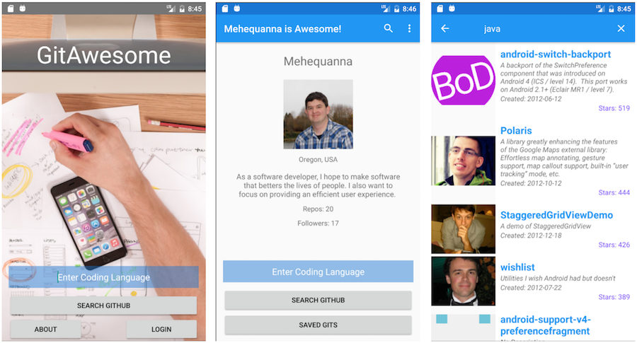

## Project Name
GitAwesome

## Description
This Android app will allow users to search the GitHub API for themselves and repositories by language. The user will be able to create a user account and save details, for example, Github username. This is a four day project.

## Technologies
Android Studio, Java, Github API, Meetup API, Firebase, Gradle

## Current Features
* Searching Github Repos from the Landing Activity
* Logging and saving details with Firebase
* Uses Github API
* User page shows Github details about the user based on their username

## Future Features
* Add testing back in
* Implement Meetup API
* Make theme change by day or night

## Usage
* Open Android Studio
* Click on "Check out project from Version Control"
* In the popup that appears, click on Git
* Enter the Git Repo details: https://github.com/Mehequanna/GitAwesome
* Check everything by clicking "Test"
* Then click "clone"
* Follow the prompts. Note: There may need to be some refactoring on your end based on your version of Android Studio.

## Known Issues

## Author
Stephen Emery

## License
This work can be used under the MIT License.
Copyright (c) 2016 Stephen Emery
